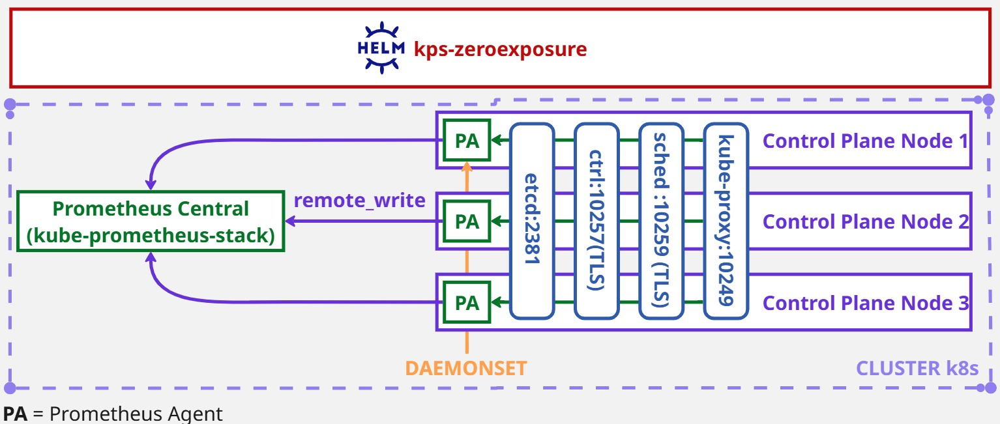

# kps-zeroexposure


This Helm chart provides a secure, zero-exposure method for collecting Kubernetes control plane metrics using Prometheus Agent.

It is designed to complement an existing deployment of **kube-prometheus-stack** by scraping critical components : **etcd**, **kube-scheduler**, **kube-controller-manager** and **kube-proxy** locally on control-plane nodes and pushing metrics via remote_write.

No service is exposed. No port is opened. No strange workaround.



## Main Features
- Deploys a Prometheus Agent as DaemonSet only on control-plane nodes.
- Locally scrapes the following control plane components:
  - **etcd** on **127.0.0.1:2381**
  - **kube-scheduler** on **127.0.0.1:10259** (HTTPS)
  - **kube-controller-manager** on **127.0.0.1:10257** (HTTPS)
  - **kube-proxy** on **127.0.0.1:10249**
- Pushes metrics to a central Prometheus instance (kube-prometheus-stack) via **remote_write**.
- TLS support for secure access to internal components.
- No reliance on Kubernetes Service, NodePort, or binding to 0.0.0.0.

## Prerequisites

Before deploying kps-zeroexposure, ensure you have:

- kube-prometheus-stack is already installed with the following components disabled in its values.yaml:
  - `kubeEtcd.enabled = false`
  - `kubeScheduler.enabled = false`
  - `kubeControllerManager.enabled = false`
  - `kubeProxy.enabled = false`
- Remote write is enabled in kube-prometheus-stack values.yaml:
  - `enableRemoteWriteReceiver = true`
- Access to control-plane node certificates via **/etc/kubernetes/pki**
- Helm 3.x installed
- A running Kubernetes cluster (v1.20+)

## Installation

1. Clone the repository

```bash
git clone https://github.com/adrghph/kps-zeroexposure.git
cd kps-zeroexposure
```

2. Configure your values.yaml with your central Prometheus remote_write URL:

```bash
remoteWriteUrl: http://prometheus-stack-kube-prom-prometheus.monitoring.svc.cluster.local:9090/api/v1/write
```

3. Deploy the agent in your target namespace:

```bash
helm install kps . --namespace <namespace> 
```
**Note**: It is strongly recommended to deploy kps-zeroexposure in the same namespace as kube-prometheus-stack (usually monitoring) to ensure service discovery and metric delivery work properly.

## Configuration

| Parameter        | Description                                                          | Default Value   |
|------------------|----------------------------------------------------------------------|-----------------|
| remoteWriteUrl   | URL to send scraped metrics to (/api/v1/write on central Prometheus) | see values.yaml |
| nodeSelector     | Ensures agent runs only on control-plane nodes                       | see values.yaml |
| tolerations      | Allows scheduling on tainted control-plane nodes                     | see values.yaml |
| image.repository | Prometheus image                                                     | prom/prometheus |
| image.tag        | Image version                                                        | v2.52.0         |
| image.pullPolicy | Pull policy for the image                                            | IfNotPresent    |

## TLS Configuration

This chart mounts the local Kubernetes certificate directory:

```bash
volumes:
  - name: kube-certs
    hostPath:
      path: /etc/kubernetes/pki
      type: DirectoryOrCreate
```
The following targets require HTTPS access and valid certs:
 - kube-controller-manager
 - kube-scheduler

You may use insecure_skip_verify: true if you're in a trusted cluster environment, or configure your CA/certs accordingly.

## Alerting

This chart does **not** evaluate alerts itself — Prometheus is deployed in **agent mode** only:
- No local time-series storage
- No alert evaluation engine
- No web UI

However, **all scraped metrics are pushed via `remote_write`** to your central Prometheus instance, where:

- Alerts **can and should** be defined
- You can use the `source` and `job` labels (`etcd-local`, `scheduler-local`, etc.) for targeting
  - Request PromQL = **up{source="kps-agent"}**
  - Request PromQL = **up{job="etcd-local"}**
- Dashboards and Alertmanager integrations are fully supported

This model ensures clean separation of concerns:

| Component         | Role                        |
|------------------|-----------------------------|
| `kps-zeroexposure` | Scrapes locally, pushes metrics |
| Prometheus central | Stores, evaluates, alerts     |

## Why this project

When deploying kube-prometheus-stack, many users face the following issues:
 - Targets for etcd, scheduler, controller-manager, and kube-proxy are DOWN.
 - The corresponding Kubernetes Services have ClusterIP: None or do not exist.
 - Metrics are not reachable unless insecure flags or hostNetwork hacks are used.
 - Changing the Kubernetes static pod manifests to bind to 0.0.0.0 is discouraged.

kps-zeroexposure solves this cleanly:
 - No need to expose internal components.
 - Metrics are collected locally, then pushed.
 - Works out-of-the-box on hardened clusters.
